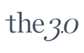

# THE 3.0 Dermatology Skin Analysis Platform

> **Government R&D Project** - Skin Diagnosis App & Beauty Device Development
> Supported by: Korea Technology and Information Promotion Agency for SMEs (TIPA)
> Project No: S2827843

<p align="center">
  
</p>

## Overview

This project is a full-stack web platform developed for **THE 3.0 Co., Ltd.** as part of a Korean government-funded R&D initiative. The system integrates IoT skin analysis devices with a web-based diagnostic platform, enabling real-time skin condition monitoring and treatment management.

### Key Features

- **Skin Analysis**: Real-time skin condition measurement (moisture, elasticity, thickness)
- **IoT Device Integration**: RESTful API communication with C++ embedded devices
- **Treatment Management**: Support for multiple treatment modes (Vibration, Iontophoresis, High-frequency, LED)
- **Patient Portal**: Self-diagnosis, consultation requests, and result tracking
- **Admin Dashboard**: Patient data management and device telemetry monitoring

## Tech Stack

| Category | Technology |
|----------|------------|
| **Backend** | Java 8, Spring MVC 5.2.15, MyBatis 3.5.6 |
| **Frontend** | JSP, Apache Tiles 3.0.8, JavaScript |
| **Database** | MySQL 8.0 / MariaDB |
| **IoT Module** | C++14, libcurl, CMake |
| **Build** | Maven 3.x |
| **Deployment** | AWS EC2, RDS, S3 |
| **Monitoring** | AWS CloudWatch, New Relic APM |

## System Architecture

```
┌─────────────────────────────────────────────────────────────────┐
│                        Client Layer                              │
├──────────────────┬──────────────────┬───────────────────────────┤
│   Web Browser    │   Admin Panel    │   IoT Skin Device (C++)   │
└────────┬─────────┴────────┬─────────┴─────────────┬─────────────┘
         │                  │                       │
         │     HTTP/JSP     │     HTTP/JSP          │  REST API
         │                  │                       │  (JSON)
         ▼                  ▼                       ▼
┌─────────────────────────────────────────────────────────────────┐
│                    Spring MVC Controller                         │
├─────────────────────────────────────────────────────────────────┤
│  HomeController │ DiagnosisController │ IoTApiController        │
└────────┬────────┴─────────┬───────────┴─────────────┬───────────┘
         │                  │                         │
         ▼                  ▼                         ▼
┌─────────────────────────────────────────────────────────────────┐
│                      Service Layer                               │
├─────────────────────────────────────────────────────────────────┤
│  MemberService │ DiagnosisService │ AdminDataService            │
└────────┬────────┴─────────┬───────┴─────────────────┬───────────┘
         │                  │                         │
         ▼                  ▼                         ▼
┌─────────────────────────────────────────────────────────────────┐
│                    MyBatis DAO Layer                             │
└────────────────────────────┬────────────────────────────────────┘
                             │
                             ▼
┌─────────────────────────────────────────────────────────────────┐
│                     MySQL Database                               │
│  ┌──────────┐ ┌──────────┐ ┌──────────┐ ┌──────────┐           │
│  │ member   │ │diagnosis │ │adminData │ │ inquiry  │           │
│  └──────────┘ └──────────┘ └──────────┘ └──────────┘           │
└─────────────────────────────────────────────────────────────────┘
```

## Project Structure

```
the3.0-dermatology-hospital-website/
├── src/main/
│   ├── java/lsj/spring/project/
│   │   ├── controller/          # MVC Controllers
│   │   │   ├── HomeController.java
│   │   │   ├── DiagnosisController.java
│   │   │   ├── IoTApiController.java    # IoT REST API
│   │   │   └── ...
│   │   ├── service/             # Business Logic
│   │   ├── dao/                 # Data Access Objects
│   │   ├── vo/                  # Value Objects
│   │   ├── dto/                 # Data Transfer Objects
│   │   │   ├── ApiResponse.java
│   │   │   ├── SkinAnalysisRequest.java
│   │   │   └── TreatmentDataRequest.java
│   │   └── interceptor/         # API Authentication
│   │       └── ApiKeyInterceptor.java
│   ├── resources/
│   │   └── mybatis3/            # MyBatis Mapper XMLs
│   └── webapp/
│       ├── WEB-INF/
│       │   ├── spring/          # Spring Configuration
│       │   ├── tiles/           # Tiles Layout
│       │   └── views/           # JSP Views
│       └── resources/           # Static Resources (CSS, JS, Images)
├── iot-device/                  # C++ IoT Device Module
│   ├── include/
│   │   ├── Config.h
│   │   ├── HttpClient.h
│   │   └── SkinSensor.h
│   ├── src/
│   │   ├── main.cpp
│   │   ├── HttpClient.cpp
│   │   └── SkinSensor.cpp
│   ├── CMakeLists.txt
│   └── README.md
├── monitoring/                  # Monitoring Configuration
│   ├── cloudwatch/
│   │   ├── amazon-cloudwatch-agent.json
│   │   └── cloudwatch-alarms.json
│   └── newrelic/
│       └── newrelic.yml
├── scripts/                     # Deployment Scripts
│   ├── deploy.sh
│   └── setup-monitoring.sh
├── docs/                        # Documentation
│   └── architecture.md
├── docker-compose.yml           # MySQL Container
├── init.sql                     # Database Schema
└── pom.xml                      # Maven Configuration
```

## Installation & Setup

### Prerequisites

- Java 8 (JDK 1.8)
- Maven 3.x
- Docker (for MySQL)

### 1. Clone Repository

```bash
git clone https://github.com/seungjun-Lee0/the3.0-dermatology-hospital-website.git
cd the3.0-dermatology-hospital-website
```

### 2. Start Database

```bash
docker-compose up -d
```

This creates a MySQL container with:
- Database: `the3`
- Username: `root`
- Password: `root1234`
- Port: `3306`

### 3. Run Application

```bash
mvn tomcat7:run
```

### 4. Access Application

Open browser: `http://localhost:8080`

**Default Admin Account:**
- ID: `admin`
- Password: `admin1234`

## IoT API Endpoints

| Method | Endpoint | Description |
|--------|----------|-------------|
| GET | `/api/iot/health` | Server health check |
| POST | `/api/iot/skin-analysis` | Submit skin analysis data |
| POST | `/api/iot/treatment` | Submit treatment session data |
| POST | `/api/iot/telemetry/batch` | Batch telemetry upload |
| GET | `/api/iot/data` | Retrieve stored data |

### Authentication

All API requests require the `X-API-Key` header:

```
X-API-Key: THE3-IOT-API-KEY-2021
```

### Sample Request

```json
POST /api/iot/skin-analysis
Content-Type: application/json
X-API-Key: THE3-IOT-API-KEY-2021

{
  "deviceId": "THE3-SKIN-DEVICE-001",
  "patientName": "John Doe",
  "birthDate": "1990-01-01",
  "pd1": "125.50",
  "pd2": "130.25",
  "moistureLevel": "65.00",
  "elasticityResult": "good",
  "thicknessResult": "normal"
}
```

## Building IoT Device Module

See [iot-device/README.md](iot-device/README.md) for C++ module build instructions.

```bash
cd iot-device
mkdir build && cd build
cmake ..
make
./THE3_SkinAnalyzer
```

## Environment Variables

The application uses environment variables for production configuration. Local defaults are provided for development.

| Variable | Description | Default (Dev) |
|----------|-------------|---------------|
| `DB_HOST` | Database host | `localhost` |
| `DB_PORT` | Database port | `3306` |
| `DB_NAME` | Database name | `the3` |
| `DB_USERNAME` | Database username | `root` |
| `DB_PASSWORD` | Database password | `root1234` |
| `MAIL_USERNAME` | Gmail SMTP username | *(see application.properties)* |
| `MAIL_PASSWORD` | Gmail app password | *(see application.properties)* |
| `IOT_API_KEY` | IoT device API key | `THE3-IOT-API-KEY-2021` |

For AWS deployment, set these as EC2 environment variables or use AWS Systems Manager Parameter Store.

Configuration file: [`src/main/resources/application.properties`](src/main/resources/application.properties)

## Monitoring & Operations

### CloudWatch

The platform uses AWS CloudWatch for infrastructure monitoring:

- **Metrics**: CPU, memory, disk, network (collected every 60 seconds)
- **Logs**: Application logs forwarded to CloudWatch Log Groups
- **Alarms**: Automated alerts for threshold violations

Setup:
```bash
./scripts/setup-monitoring.sh
```

Configuration: See [monitoring/cloudwatch/](monitoring/cloudwatch/)

### New Relic APM

Application Performance Monitoring is handled by New Relic:

- Transaction tracing for API endpoints
- Error tracking and alerting
- JVM metrics and profiling

Configuration: See [monitoring/newrelic/](monitoring/newrelic/)

### Deployment

```bash
# Deploy with backup and rollback support
./scripts/deploy.sh [VERSION]
```

See [docs/architecture.md](docs/architecture.md) for detailed infrastructure documentation.

## License

Copyright (c) 2021 THE 3.0 Co., Ltd.

This project was developed as part of a government-funded R&D project (Project No: S2827843) supported by the Korea Technology and Information Promotion Agency for SMEs (TIPA).

---

# THE 3.0 피부과 피부 분석 플랫폼

> **정부 R&D 과제** - 피부 진단 앱 및 미용 기기 개발
> 지원기관: 중소기업기술정보진흥원 (TIPA)
> 과제번호: S2827843

## 개요

본 프로젝트는 **㈜ 더삼점영**의 정부 지원 R&D 과제로 개발된 풀스택 웹 플랫폼입니다. IoT 피부 분석 기기와 웹 기반 진단 플랫폼을 통합하여 실시간 피부 상태 모니터링 및 치료 관리를 지원합니다.

### 주요 기능

- **피부 분석**: 실시간 피부 상태 측정 (수분, 탄력, 두께)
- **IoT 기기 연동**: C++ 임베디드 기기와 RESTful API 통신
- **치료 관리**: 다중 치료 모드 지원 (진동, 이온토포레시스, 고주파, LED)
- **환자 포털**: 자가 진단, 상담 신청, 결과 조회
- **관리자 대시보드**: 환자 데이터 관리 및 기기 텔레메트리 모니터링

## 기술 스택

| 구분 | 기술 |
|------|------|
| **백엔드** | Java 8, Spring MVC 5.2.15, MyBatis 3.5.6 |
| **프론트엔드** | JSP, Apache Tiles 3.0.8, JavaScript |
| **데이터베이스** | MySQL 8.0 / MariaDB |
| **IoT 모듈** | C++14, libcurl, CMake |
| **빌드** | Maven 3.x |
| **배포** | AWS EC2, RDS, S3 |
| **모니터링** | AWS CloudWatch, New Relic APM |

## 설치 및 실행

### 사전 요구사항

- Java 8 (JDK 1.8)
- Maven 3.x
- Docker (MySQL용)

### 1. 저장소 복제

```bash
git clone https://github.com/seungjun-Lee0/the3.0-dermatology-hospital-website.git
cd the3.0-dermatology-hospital-website
```

### 2. 데이터베이스 실행

```bash
docker-compose up -d
```

### 3. 애플리케이션 실행

```bash
mvn tomcat7:run
```

### 4. 접속

브라우저에서 `http://localhost:8080` 접속

**기본 관리자 계정:**
- ID: `admin`
- 비밀번호: `admin1234`

## IoT API 엔드포인트

| 메서드 | 엔드포인트 | 설명 |
|--------|----------|------|
| GET | `/api/iot/health` | 서버 상태 확인 |
| POST | `/api/iot/skin-analysis` | 피부 분석 데이터 전송 |
| POST | `/api/iot/treatment` | 치료 세션 데이터 전송 |
| POST | `/api/iot/telemetry/batch` | 배치 텔레메트리 업로드 |
| GET | `/api/iot/data` | 저장된 데이터 조회 |

### 인증

모든 API 요청에 `X-API-Key` 헤더 필요:

```
X-API-Key: THE3-IOT-API-KEY-2021
```

## 환경 변수

프로덕션 환경에서는 환경 변수를 통해 설정을 관리합니다. 개발 환경용 기본값이 제공됩니다.

| 변수 | 설명 | 기본값 (개발) |
|------|------|--------------|
| `DB_HOST` | 데이터베이스 호스트 | `localhost` |
| `DB_PORT` | 데이터베이스 포트 | `3306` |
| `DB_NAME` | 데이터베이스 이름 | `the3` |
| `DB_USERNAME` | 데이터베이스 사용자명 | `root` |
| `DB_PASSWORD` | 데이터베이스 비밀번호 | `root1234` |
| `MAIL_USERNAME` | Gmail SMTP 사용자명 | *(application.properties 참조)* |
| `MAIL_PASSWORD` | Gmail 앱 비밀번호 | *(application.properties 참조)* |
| `IOT_API_KEY` | IoT 기기 API 키 | `THE3-IOT-API-KEY-2021` |

AWS 배포 시 EC2 환경 변수 또는 AWS Systems Manager Parameter Store를 통해 설정하세요.

설정 파일: [`src/main/resources/application.properties`](src/main/resources/application.properties)

## 모니터링 및 운영

### CloudWatch

AWS CloudWatch를 통한 인프라 모니터링:

- **메트릭**: CPU, 메모리, 디스크, 네트워크 (60초 간격 수집)
- **로그**: 애플리케이션 로그를 CloudWatch Log Groups로 전달
- **알람**: 임계값 위반 시 자동 알림

설정:
```bash
./scripts/setup-monitoring.sh
```

설정 파일: [monitoring/cloudwatch/](monitoring/cloudwatch/)

### New Relic APM

New Relic을 통한 애플리케이션 성능 모니터링:

- API 엔드포인트 트랜잭션 추적
- 오류 추적 및 알림
- JVM 메트릭 및 프로파일링

설정 파일: [monitoring/newrelic/](monitoring/newrelic/)

### 배포

```bash
# 백업 및 롤백 지원 배포
./scripts/deploy.sh [VERSION]
```

상세 인프라 문서: [docs/architecture.md](docs/architecture.md)

## 라이선스

Copyright (c) 2021 ㈜ 더삼점영

본 프로젝트는 중소기업기술정보진흥원(TIPA) 지원 정부 R&D 과제(과제번호: S2827843)로 개발되었습니다.
